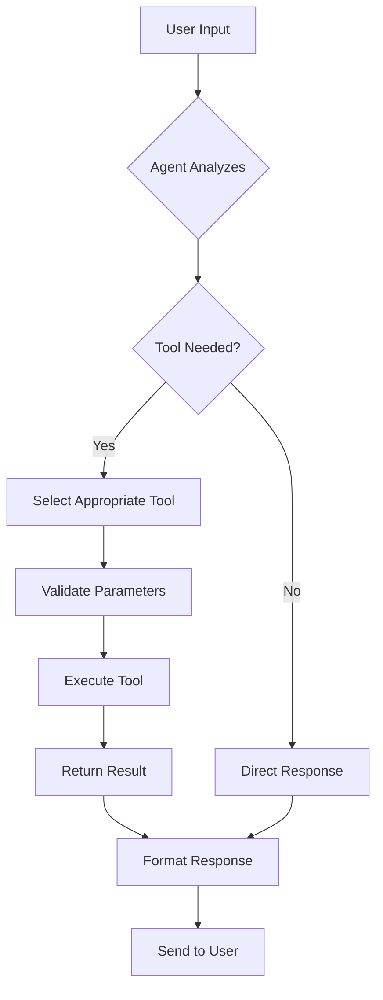

## Overview

The rootAgent is equipped with three `FunctionTool` implementations from the Google ADK framework. These tools enable the agent to retrieve time information, create visual diagrams, and display source code.

<Note>
All tools use **Zod schemas** for parameter validation and type safety.
</Note>

## FunctionTool Structure

Each tool in the ADK follows this structure:

```typescript
const toolName = new FunctionTool({
  name: "tool_name",              // Snake_case identifier
  description: "Tool purpose",    // Clear description for the LLM
  parameters: z.object({          // Zod schema for validation
    param: z.type().describe("Parameter description")
  }),
  execute: (params) => {          // Implementation function
    return {
      status: "success",
      report: "Result data"
    };
  },
});
```

## Tool 1: getCurrentTime

### Overview

Retrieves the current time for a specified city. This is a mock implementation that returns a fixed time.

### Parameters

<ParamField path="city" type="string" required>
  The name of the city for which to retrieve the current time.
</ParamField>

### Complete Implementation

```typescript
const getCurrentTime = new FunctionTool({
  name: "get_current_time",
  description: "Returns the current time in a specified city.",
  parameters: z.object({
    city: z
      .string()
      .describe("The name of the city for which to retrieve the current time."),
  }),
  execute: ({ city }) => {
    return {
      status: "success",
      report: `The current time in ${city} is 10:30 AM`,
    };
  },
});
```

### Usage Example

When a user asks: "What time is it in London?"

The agent will:
1. Recognize the time query
2. Call `get_current_time` with `city: "London"`
3. Return: "The current time in London is 10:30 AM"

### Return Format

```typescript
{
  status: "success",
  report: "The current time in [city] is 10:30 AM"
}
```

## Tool 2: createMermaidDiagram

### Overview

Generates Mermaid diagrams in markdown format. Supports nine different diagram types for various visualization needs.

### Parameters

<ParamField path="type" type="enum" required>
  The type of diagram to create. Supported values:
  - `flowchart` - Flow charts and process diagrams
  - `sequence` - Sequence diagrams for interactions
  - `class` - Class diagrams for object-oriented design
  - `state` - State diagrams for state machines
  - `er` - Entity-relationship diagrams
  - `gantt` - Gantt charts for project timelines
  - `pie` - Pie charts for data visualization
  - `mindmap` - Mind maps for brainstorming
  - `timeline` - Timeline diagrams
</ParamField>

<ParamField path="definition" type="string" required>
  The mermaid diagram definition using Mermaid syntax.
</ParamField>

### Complete Implementation

```typescript
const createMermaidDiagram = new FunctionTool({
  name: "create_mermaid_diagram",
  description: "Creates a mermaid diagram using markdown.",
  parameters: z.object({
    type: z
      .enum([
        "flowchart",
        "sequence",
        "class",
        "state",
        "er",
        "gantt",
        "pie",
        "mindmap",
        "timeline",
      ])
      .describe("The type of diagram to create."),
    definition: z.string().describe("The mermaid diagram definition."),
  }),
  execute: ({ definition }) => {
    return {
      status: "success",
      report: `\`\`\`mermaid\n${definition}\n\`\`\``,
    };
  },
});
```

### Usage Example

When a user asks: "Show me a flowchart of a login process"

The agent will:
1. Recognize the diagram request
2. Call `create_mermaid_diagram` with appropriate type and definition
3. Return a formatted markdown code block with the Mermaid diagram

### Return Format

```typescript
{
  status: "success",
  report: "```mermaid\n[diagram definition]\n```"
}
```

### Diagram Types Reference

<AccordionGroup>
  <Accordion title="Flowchart" icon="diagram-project">
    Process flows and decision trees
    ```mermaid
    flowchart TD
        A[Start] --> B{Decision}
        B -->|Yes| C[Action 1]
        B -->|No| D[Action 2]
    ```
  </Accordion>
  
  <Accordion title="Sequence" icon="arrows-left-right">
    Interactions between components or actors
    ```mermaid
    sequenceDiagram
        User->>API: Request
        API->>Database: Query
        Database-->>API: Data
        API-->>User: Response
    ```
  </Accordion>
  
  <Accordion title="Class" icon="sitemap">
    Object-oriented class structures
    ```mermaid
    classDiagram
        class Animal {
            +String name
            +makeSound()
        }
    ```
  </Accordion>
</AccordionGroup>

## Tool 3: viewSourceCode

### Overview

Displays source code in a formatted code block. Useful for showing code examples or implementations to users.

### Parameters

<ParamField path="definition" type="string" required>
  The kind of source code the user wants to see. This serves as both the description and the code content to display.
</ParamField>

### Complete Implementation

```typescript
const viewSourceCode = new FunctionTool({
  name: "view_source_code",
  description:
    "Shows the source code asked by the user",
  parameters: z.object({ 
    definition: z.string().describe("The kind of source code the user wants to see.") 
  }),
  execute: ({ definition }) => {
    return {
      status: "success",
      report: `\`\`\`sourcecode\n${definition}\n\`\`\``,
    };
  },
});
```

### Usage Example

When a user asks: "Show me the agent configuration code"

The agent will:
1. Recognize the source code request
2. Call `view_source_code` with the relevant code
3. Return a formatted code block

### Return Format

```typescript
{
  status: "success",
  report: "```sourcecode\n[code content]\n```"
}
```

## Creating Custom Tools

### Step-by-Step Guide

<Steps>
  <Step title="Import Dependencies">
    ```typescript
    import { FunctionTool } from "@google/adk";
    import { z } from "zod";
    ```
  </Step>
  
  <Step title="Define the Tool">
    ```typescript
    const myCustomTool = new FunctionTool({
      name: "my_custom_tool",
      description: "Clear description of what the tool does",
      parameters: z.object({
        // Define parameters with Zod
      }),
      execute: (params) => {
        // Implement tool logic
        return {
          status: "success",
          report: "Result"
        };
      },
    });
    ```
  </Step>
  
  <Step title="Add to Agent">
    ```typescript
    tools: [getCurrentTime, createMermaidDiagram, viewSourceCode, myCustomTool]
    ```
  </Step>
</Steps>

### Best Practices

<CardGroup cols={2}>
  <Card title="Clear Naming" icon="tag">
    Use descriptive snake_case names that clearly indicate the tool's purpose
  </Card>
  
  <Card title="Detailed Descriptions" icon="file-lines">
    Write clear descriptions to help the LLM understand when to use the tool
  </Card>
  
  <Card title="Type Safety" icon="shield">
    Use Zod schemas for all parameters to ensure type validation
  </Card>
  
  <Card title="Consistent Returns" icon="arrow-left">
    Always return objects with `status` and `report` fields
  </Card>
</CardGroup>

## Zod Parameter Schemas

### Common Zod Types

```typescript
// String
z.string().describe("Description")

// Number
z.number().describe("Description")

// Boolean
z.boolean().describe("Description")

// Enum
z.enum(["option1", "option2", "option3"]).describe("Description")

// Array
z.array(z.string()).describe("Description")

// Optional
z.string().optional().describe("Description")

// With default
z.string().default("default value").describe("Description")
```

### Complex Example

```typescript
parameters: z.object({
  name: z.string().describe("User name"),
  age: z.number().min(0).max(150).describe("User age"),
  role: z.enum(["admin", "user", "guest"]).describe("User role"),
  preferences: z.object({
    theme: z.enum(["light", "dark"]),
    notifications: z.boolean()
  }).optional().describe("User preferences")
})
```

## Tool Execution Flow



## Source Location

All tools are defined in: `~/workspace/source/app/agents/agent1.ts`

## Next Steps

<CardGroup cols={2}>
  <Card title="Root Agent" icon="robot" href="/api/agents/root-agent">
    Learn about the rootAgent configuration
  </Card>
  <Card title="ADK Documentation" icon="book" href="https://google.github.io/agentic-ai/">
    Explore the Google ADK framework
  </Card>
</CardGroup>
