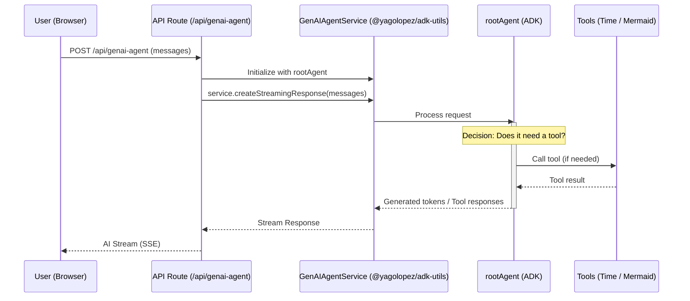

## Overview

When a user sends a message in the ADK Utils Example chat interface, it goes through a sophisticated flow involving the Next.js API route, the GenAIAgentService utility, the ADK agent, and potentially multiple tools before streaming back to the user.

This page explains the complete request lifecycle with real code examples.

## Visual Flow Diagram

The following sequence diagram illustrates the complete request flow:



## Step-by-Step Flow

<Steps>
  <Step title="User sends message in browser">
    The user types a message and clicks send. The `page.tsx` component handles the submission.
    
    **Code:** [app/page.tsx:45-48](https://github.com/YagoLopez/adk-utils-example/blob/main/app/page.tsx)
    
    ```typescript
    const handleSubmit = () => {
      if (!input.trim() || isLoading) return;
      sendUserMessage(input, true);
    };
    ```
    
    The `sendUserMessage` function is rate-limited using `@tanstack/react-pacer`:
    
    ```typescript
    const sendUserMessage = useRateLimitedCallback(
      (text: string, clearInput: boolean) => {
        sendMessage({ text });
        if (clearInput) setInput("");
      },
      {
        limit: LIMIT, // 20 messages
        window: ONE_HOUR_IN_MS, // per hour
        onReject: () => {
          alert(`Rate limit exceeded...`);
        },
      },
    );
    ```
  </Step>
  
  <Step title="useChat hook sends POST request">
    The `useChat` hook from `@ai-sdk/react` sends a POST request to `/api/genai-agent`.
    
    **Code:** [app/page.tsx:18-23](https://github.com/YagoLopez/adk-utils-example/blob/main/app/page.tsx)
    
    ```typescript
    const transport = new DefaultChatTransport({ api: "/api/genai-agent" });
    
    export default function Home() {
      const { messages, setMessages, sendMessage, status } = useChat({ transport });
      const isLoading = status === "streaming" || status === "submitted";
      // ...
    }
    ```
    
    The request includes all previous messages in the conversation history.
  </Step>
  
  <Step title="API Route receives request">
    The `/api/genai-agent` endpoint receives the POST request with the messages array.
    
    **Code:** [app/api/genai-agent/route.ts:5-16](https://github.com/YagoLopez/adk-utils-example/blob/main/app/api/genai-agent/route.ts)
    
    ```typescript
    export async function POST(req: Request) {
      try {
        const { messages }: { messages: UIMessage[] } = await req.json();
    
        const service = new GenAIAgentService(rootAgent);
    
        if (!service.validateMessages(messages)) {
          return GenAIAgentService.createErrorResponse(
            "Messages are required",
            400,
          );
        }
    ```
    
    The route imports the `rootAgent` from `app/agents/agent1.ts` and initializes the `GenAIAgentService`.
  </Step>
  
  <Step title="GenAIAgentService processes request">
    The `GenAIAgentService` from `@yagolopez/adk-utils` validates messages and creates a streaming response.
    
    **Code:** [app/api/genai-agent/route.ts:18](https://github.com/YagoLopez/adk-utils-example/blob/main/app/api/genai-agent/route.ts)
    
    ```typescript
    return service.createStreamingResponse(messages);
    ```
    
    <Note>
    The `GenAIAgentService` is a utility class from the `@yagolopez/adk-utils` package that simplifies integration between ADK agents and Next.js API routes.
    </Note>
    
    **Key responsibilities:**
    - Message validation
    - Format conversion between AI SDK and ADK formats
    - Streaming response management
    - Error handling
  </Step>
  
  <Step title="ADK Agent processes the request">
    The `rootAgent` (an `LlmAgent` instance) receives the processed messages.
    
    **Code:** [app/agents/agent1.ts:62-75](https://github.com/YagoLopez/adk-utils-example/blob/main/app/agents/agent1.ts)
    
    ```typescript
    export const rootAgent = new LlmAgent({
      name: "agent1",
      model: new OllamaModel("gpt-oss:120b-cloud", "https://ollama.com"),
      description:
        "Agent with three function tools: get_current_time, create_mermaid_diagram and view_source_code...",
      instruction: `You are a helpful assistant.
                    If the user ask for the time in a city, Use the 'get_current_time' tool...
                    If the user asks for a diagram or visual representation, use the 'create_mermaid_diagram' tool.
                    If the user asks to view source code, use the 'view_source_code' tool.`,
      tools: [getCurrentTime, createMermaidDiagram, viewSourceCode],
    });
    ```
    
    The agent:
    1. Analyzes the user's message
    2. Determines if it needs to use a tool
    3. Generates a response or tool call
  </Step>
  
  <Step title="Tool execution (if needed)">
    If the agent decides to use a tool, it executes the appropriate `FunctionTool`.
    
    **Example Tool:** `get_current_time` ([app/agents/agent1.ts:6-20](https://github.com/YagoLopez/adk-utils-example/blob/main/app/agents/agent1.ts))
    
    ```typescript
    const getCurrentTime = new FunctionTool({
      name: "get_current_time",
      description: "Returns the current time in a specified city.",
      parameters: z.object({
        city: z
          .string()
          .describe("The name of the city for which to retrieve the current time."),
      }),
      execute: ({ city }) => {
        return {
          status: "success",
          report: `The current time in ${city} is 10:30 AM`,
        };
      },
    });
    ```
    
    **Available Tools:**
    - `get_current_time` - Retrieves time for any city
    - `create_mermaid_diagram` - Generates Mermaid diagrams
    - `view_source_code` - Shows source code examples
  </Step>
  
  <Step title="Response streams back to client">
    The agent's response (including tool results) streams back through the service to the client.
    
    The response is a **Server-Sent Events (SSE)** stream that allows real-time token-by-token delivery.
    
    **Client-side handling:** [app/page.tsx:79-91](https://github.com/YagoLopez/adk-utils-example/blob/main/app/page.tsx)
    
    ```typescript
    {messages.map((message, index) => {
      const botMessages = messages.filter(m => m.role === 'assistant');
      const lastBotMessage = botMessages[botMessages.length - 1];
      const isLastBotMessage = message.role === 'assistant' && 
                                message.id === lastBotMessage?.id;

      return (
        <ChatMessage
          key={message.id}
          message={message}
          isLastBotMessage={isLastBotMessage}
        />
      );
    })}
    ```
  </Step>
  
  <Step title="UI renders the response">
    The `ChatMessage` component renders the streamed response with Markdown, code highlighting, and Mermaid diagrams.
    
    **Code:** [components/chat-message.tsx:100-108](https://github.com/YagoLopez/adk-utils-example/blob/main/components/chat-message.tsx)
    
    ```typescript
    {message.parts.map((part, index) => {
      if (part.type === "text") {
        return (
          <div key={index} className="streamdown-content w-full min-w-0">
            <Streamdown plugins={{ code, mermaid }}>
              {part.text}
            </Streamdown>
          </div>
        );
      }
      // Handle tool results...
    })}
    ```
    
    The component uses **Streamdown** with plugins for:
    - Syntax highlighting (via `@streamdown/code`)
    - Mermaid diagram rendering (via `@streamdown/mermaid`)
  </Step>
</Steps>

## Key Components

### 1. GenAIAgentService (@yagolopez/adk-utils)

<Card title="Purpose" icon="cog">
  The `GenAIAgentService` bridges the gap between the AI SDK and ADK, providing a simplified API for agent communication.
</Card>

**Key methods:**
- `validateMessages(messages)` - Validates the messages array
- `createStreamingResponse(messages)` - Creates a streaming SSE response
- `createErrorResponse(message, status, error?)` - Creates error responses

**Usage in route:** [app/api/genai-agent/route.ts:9](https://github.com/YagoLopez/adk-utils-example/blob/main/app/api/genai-agent/route.ts)
```typescript
const service = new GenAIAgentService(rootAgent);
```

### 2. OllamaModel (@yagolopez/adk-utils)

<Card title="Purpose" icon="server">
  The `OllamaModel` class enables ADK agents to use Ollama models (local or remote).
</Card>

**Usage in agent:** [app/agents/agent1.ts:67](https://github.com/YagoLopez/adk-utils-example/blob/main/app/agents/agent1.ts)
```typescript
model: new OllamaModel("gpt-oss:120b-cloud", "https://ollama.com")
```

**Supported endpoints:**
- Local: `http://localhost:11434`
- Remote: `https://ollama.com` (for cloud models)

### 3. Rate Limiting

<Tip>
Rate limiting protects the API from abuse and ensures fair usage across users.
</Tip>

Implemented using `@tanstack/react-pacer`:

**Configuration:** [lib/constants.ts:26-27](https://github.com/YagoLopez/adk-utils-example/blob/main/lib/constants.ts)
```typescript
export const LIMIT = 20;
export const ONE_HOUR_IN_MS = 60 * 60 * 1000;
```

**Implementation:** [app/page.tsx:29-43](https://github.com/YagoLopez/adk-utils-example/blob/main/app/page.tsx)
```typescript
const sendUserMessage = useRateLimitedCallback(
  (text: string, clearInput: boolean) => {
    sendMessage({ text });
    if (clearInput) setInput("");
  },
  {
    limit: LIMIT,
    window: ONE_HOUR_IN_MS,
    onReject: () => {
      alert(`Rate limit exceeded. You can only send ${LIMIT} messages per hour.`);
    },
  },
);
```

## Data Format

### Request Format

The API route receives an array of `UIMessage` objects:

```typescript
interface UIMessage {
  id: string;
  role: 'user' | 'assistant' | 'system';
  content: string;
  createdAt?: Date;
}
```

### Response Format

The response is a **streaming SSE response** with incremental text chunks:

```
data: {"type":"text","text":"Hello"}
data: {"type":"text","text":" there!"}
data: {"type":"done"}
```

<Note>
The AI SDK automatically handles the streaming response and updates the `messages` array in real-time.
</Note>

## Error Handling

Errors are caught at multiple levels:

**1. Route-level error handling:** [app/api/genai-agent/route.ts:19-26](https://github.com/YagoLopez/adk-utils-example/blob/main/app/api/genai-agent/route.ts)
```typescript
try {
  // Process request...
} catch (error) {
  console.error(error);
  return GenAIAgentService.createErrorResponse(
    "Internal Server Error",
    500,
    String(error),
  );
}
```

**2. Message validation:**
```typescript
if (!service.validateMessages(messages)) {
  return GenAIAgentService.createErrorResponse(
    "Messages are required",
    400,
  );
}
```

**3. Rate limiting:**
```typescript
onReject: () => {
  alert(`Rate limit exceeded. You can only send ${LIMIT} messages per hour.`);
}
```

## Streaming Mechanism

<Steps>
  <Step title="Service creates ReadableStream">
    The `GenAIAgentService` creates a `ReadableStream` that emits chunks as they're generated.
  </Step>
  <Step title="AI SDK consumes stream">
    The `useChat` hook subscribes to the stream and updates the `messages` state in real-time.
  </Step>
  <Step title="React re-renders on updates">
    Each chunk triggers a re-render, creating the "typing" effect.
  </Step>
  <Step title="Auto-scroll to bottom">
    The `useScrollToBottom` hook ensures the latest message is always visible.
    
    **Code:** [app/page.tsx:27](https://github.com/YagoLopez/adk-utils-example/blob/main/app/page.tsx)
    ```typescript
    useScrollToBottom(scrollRef, [messages, status]);
    ```
  </Step>
</Steps>

## Performance Considerations

<CardGroup cols={2}>
  <Card title="Rate Limiting" icon="shield-check">
    20 messages per hour per user prevents API abuse
  </Card>
  <Card title="Streaming Responses" icon="signal-stream">
    Progressive rendering improves perceived performance
  </Card>
  <Card title="Auto-scroll Optimization" icon="gauge">
    Efficient scrolling prevents layout thrashing
  </Card>
  <Card title="Component Memoization" icon="memory-stick">
    React optimizations reduce unnecessary re-renders
  </Card>
</CardGroup>

## Related Pages

<CardGroup cols={2}>
  <Card title="Project Structure" icon="folder-tree" href="/architecture/project-structure">
    Explore the complete directory structure
  </Card>
  <Card title="Root Agent" icon="robot" href="/api/agents/root-agent">
    Learn about Google ADK agents and tools
  </Card>
  <Card title="API Routes" icon="route" href="/api/routes/genai-agent">
    API endpoint reference documentation
  </Card>
  <Card title="Chat Components" icon="message-square" href="/api/components/chat-message">
    UI component documentation
  </Card>
</CardGroup>