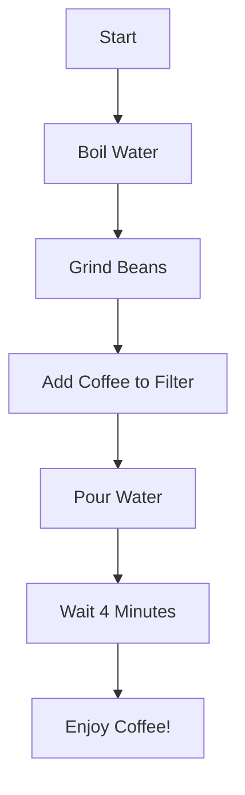

## Overview

The ADK Utils Example demonstrates how to equip agents with powerful function tools using the Google Agent Development Kit (ADK). Tools extend agent capabilities beyond text generation, enabling them to perform actions, retrieve data, and generate structured content.

<CardGroup cols={3}>
  <Card title="getCurrentTime" icon="clock">
    Retrieves current time for any city
  </Card>
  <Card title="createMermaidDiagram" icon="diagram-project">
    Generates visual diagrams from descriptions
  </Card>
  <Card title="viewSourceCode" icon="code">
    Displays formatted source code examples
  </Card>
</CardGroup>

## Tool Architecture

ADK tools are implemented using the `FunctionTool` class with three key components:

<Steps>
  <Step title="Tool Definition">
    Name, description, and parameter schema using Zod
  </Step>
  <Step title="Parameter Validation">
    Automatic validation against the Zod schema
  </Step>
  <Step title="Execute Function">
    Implementation logic that returns structured results
  </Step>
</Steps>

## Built-in Tools

### getCurrentTime Tool

A mock tool demonstrating how to retrieve external data based on user input.

```typescript app/agents/agent1.ts
import { FunctionTool, LlmAgent } from "@google/adk";
import { z } from "zod";

const getCurrentTime = new FunctionTool({
  name: "get_current_time",
  description: "Returns the current time in a specified city.",
  parameters: z.object({
    city: z
      .string()
      .describe("The name of the city for which to retrieve the current time."),
  }),
  execute: ({ city }) => {
    return {
      status: "success",
      report: `The current time in ${city} is 10:30 AM`,
    };
  },
});
```

<Note>
  This is a mock implementation. In production, you would integrate with a real time/timezone API.
</Note>

**Usage Example:**

```
User: What time is it in Tokyo?
Agent: [Calls get_current_time tool with city="Tokyo"]
Agent: The current time in Tokyo is 10:30 AM
```

### createMermaidDiagram Tool

Generates Mermaid.js diagrams directly in the chat interface.

```typescript app/agents/agent1.ts
const createMermaidDiagram = new FunctionTool({
  name: "create_mermaid_diagram",
  description: "Creates a mermaid diagram using markdown.",
  parameters: z.object({
    type: z
      .enum([
        "flowchart",
        "sequence",
        "class",
        "state",
        "er",
        "gantt",
        "pie",
        "mindmap",
        "timeline",
      ])
      .describe("The type of diagram to create."),
    definition: z.string().describe("The mermaid diagram definition."),
  }),
  execute: ({ definition }) => {
    return {
      status: "success",
      report: `\`\`\`mermaid\n${definition}\n\`\`\``,
    };
  },
});
```

<Tip>
  The tool returns markdown-formatted mermaid code blocks that are automatically rendered by the ChatMessage component's Streamdown integration.
</Tip>

**Supported Diagram Types:**

<CardGroup cols={3}>
  <Card title="Flowchart" icon="diagram-project">
    Process flows and decision trees
  </Card>
  <Card title="Sequence" icon="arrows-left-right">
    Interaction timelines between entities
  </Card>
  <Card title="Class" icon="sitemap">
    Object-oriented class structures
  </Card>
  <Card title="State" icon="circle-dot">
    State machine diagrams
  </Card>
  <Card title="ER" icon="database">
    Entity relationship diagrams
  </Card>
  <Card title="Gantt" icon="calendar">
    Project timelines and schedules
  </Card>
  <Card title="Pie" icon="chart-pie">
    Data distribution charts
  </Card>
  <Card title="Mindmap" icon="brain">
    Hierarchical idea maps
  </Card>
  <Card title="Timeline" icon="timeline">
    Chronological event sequences
  </Card>
</CardGroup>

**Usage Example:**

```
User: Create a flowchart showing how to make coffee
Agent: [Calls create_mermaid_diagram tool]
Agent: Here's the flowchart:

```

### viewSourceCode Tool

Displays formatted code examples with syntax highlighting.

```typescript app/agents/agent1.ts
const viewSourceCode = new FunctionTool({
  name: "view_source_code",
  description: "Shows the source code asked by the user",
  parameters: z.object({ 
    definition: z.string().describe("The kind of source code the user wants to see.") 
  }),
  execute: ({ definition }) => {
    return {
      status: "success",
      report: `\`\`\`sourcecode\n${definition}\n\`\`\``,
    };
  },
});
```

**Usage Example:**

```
User: Show me a JavaScript closure example
Agent: [Calls view_source_code tool]
Agent: Here's an example of a JavaScript closure:
```javascript
function createCounter() {
  let count = 0;
  return function() {
    return ++count;
  };
}
const counter = createCounter();
console.log(counter()); // 1
console.log(counter()); // 2
```
```

## Registering Tools with Agent

Tools are registered when creating the `LlmAgent` instance:

```typescript app/agents/agent1.ts
import { LlmAgent } from "@google/adk";
import { OllamaModel } from "@yagolopez/adk-utils";

export const rootAgent = new LlmAgent({
  name: "agent1",
  model: new OllamaModel("gpt-oss:120b-cloud", "https://ollama.com"),
  description:
    "Agent with three function tools: get_current_time, create_mermaid_diagram and view_source_code.",
  instruction: `You are a helpful assistant.
    If the user asks for the time in a city, use the 'get_current_time' tool.
    If the user asks for a diagram or visual representation, use the 'create_mermaid_diagram' tool.
    If the user asks to view source code, use the 'view_source_code' tool.`,
  tools: [getCurrentTime, createMermaidDiagram, viewSourceCode],
});
```

<Warning>
  The agent's instruction prompt is crucial for tool selection. Clearly describe when and how each tool should be used.
</Warning>

## Creating Custom Tools

You can easily create your own tools following the same pattern:

```typescript
import { FunctionTool } from "@google/adk";
import { z } from "zod";

const weatherTool = new FunctionTool({
  name: "get_weather",
  description: "Fetches current weather for a location",
  parameters: z.object({
    location: z.string().describe("City name or coordinates"),
    units: z.enum(["celsius", "fahrenheit"]).default("celsius"),
  }),
  execute: async ({ location, units }) => {
    // Call weather API
    const response = await fetch(
      `https://api.weather.com/data?location=${location}&units=${units}`
    );
    const data = await response.json();
    
    return {
      status: "success",
      report: `Temperature in ${location}: ${data.temp}°${units === "celsius" ? "C" : "F"}`,
      data, // Optional: include raw data for further processing
    };
  },
});
```

## Tool Execution Flow

<Steps>
  <Step title="User Query">
    User sends a message that requires tool usage
  </Step>
  <Step title="Agent Analysis">
    Agent analyzes the query and selects appropriate tool
  </Step>
  <Step title="Parameter Extraction">
    Agent extracts required parameters from user message
  </Step>
  <Step title="Validation">
    Parameters are validated against Zod schema
  </Step>
  <Step title="Execution">
    Tool's execute function runs with validated parameters
  </Step>
  <Step title="Response">
    Agent formats tool output into natural language response
  </Step>
</Steps>

## Tool Response Format

Tool responses should follow this structure:

```typescript
interface ToolResponse {
  status: "success" | "error";
  report: string;  // Human-readable message
  data?: any;      // Optional structured data
  error?: string;  // Error details if status is "error"
}
```

## Best Practices

<CardGroup cols={2}>
  <Card title="Clear Descriptions" icon="message-lines">
    Write precise tool and parameter descriptions to help the agent understand when to use each tool
  </Card>
  <Card title="Parameter Validation" icon="shield-check">
    Use Zod schemas to enforce type safety and provide helpful validation messages
  </Card>
  <Card title="Error Handling" icon="triangle-exclamation">
    Always handle errors gracefully and return informative error messages
  </Card>
  <Card title="Async Support" icon="clock">
    Use async/await for tools that call external APIs or databases
  </Card>
  <Card title="Structured Responses" icon="list-tree">
    Return both human-readable reports and structured data when applicable
  </Card>
  <Card title="Test Thoroughly" icon="vial">
    Test tools independently before integrating with agents
  </Card>
</CardGroup>

## Advanced Tool Features

### Chaining Tools

Agents can call multiple tools in sequence:

```
User: What time is it in Tokyo and show me a timeline?
Agent: 
1. [Calls get_current_time with city="Tokyo"]
2. [Calls create_mermaid_diagram with type="timeline"]
3. Combines both outputs in response
```

### Conditional Tool Usage

Tools can return data that influences agent decisions:

```typescript
const checkInventory = new FunctionTool({
  name: "check_inventory",
  description: "Checks product availability",
  parameters: z.object({ productId: z.string() }),
  execute: async ({ productId }) => {
    const stock = await db.inventory.findOne({ productId });
    return {
      status: stock.quantity > 0 ? "success" : "error",
      report: `Product ${productId}: ${stock.quantity} units available`,
      data: { inStock: stock.quantity > 0, quantity: stock.quantity },
    };
  },
});
```

## Tool Display in Chat

Tool executions are displayed in the chat interface:

```tsx
// From components/chat-message.tsx
if (part.type.startsWith("tool-")) {
  const toolName = part.type.slice(5);
  const output = "output" in part ? part.output : null;

  return (
    <div className="mt-2 rounded-lg bg-muted px-3 py-2 text-xs font-mono">
      <span className="font-semibold">Tool: </span>
      {toolName}
      {output && (
        <div className="mt-1">
          {JSON.stringify(output, null, 2)}
        </div>
      )}
    </div>
  );
}
```

<Tip>
  Tool execution details are shown to users, providing transparency about how the agent processes requests.
</Tip>

## Next Steps

<CardGroup cols={2}>
  <Card title="Mermaid Diagrams" icon="diagram-project" href="/features/mermaid-diagrams">
    Deep dive into diagram generation
  </Card>
  <Card title="Chat UI" icon="message-square" href="/features/chat-ui">
    Learn about the chat interface
  </Card>
  <Card title="API Reference" icon="book" href="/api/agents/tools">
    Complete tool API documentation
  </Card>
  <Card title="Root Agent" icon="robot" href="/api/agents/root-agent">
    Learn about agent configuration
  </Card>
</CardGroup>