## Overview

The ADK Utils Example includes powerful Mermaid.js integration that enables agents to generate visual diagrams directly in chat conversations. Diagrams are rendered beautifully with custom Dracula-inspired theming and support real-time streaming.

<CardGroup cols={2}>
  <Card title="9 Diagram Types" icon="shapes">
    Flowcharts, sequence diagrams, timelines, and more
  </Card>
  <Card title="Real-time Rendering" icon="bolt">
    Diagrams render as they stream from the agent
  </Card>
  <Card title="Dark Theme" icon="moon">
    Custom Dracula color scheme for beautiful visuals
  </Card>
  <Card title="Interactive" icon="hand-pointer">
    Pan and zoom support for complex diagrams
  </Card>
</CardGroup>

## Integration Architecture

The Mermaid integration uses three components:

<Steps>
  <Step title="Agent Tool">
    `createMermaidDiagram` function tool generates mermaid markdown
  </Step>
  <Step title="Streamdown Plugin">
    `@streamdown/mermaid` plugin parses and renders diagrams
  </Step>
  <Step title="ChatMessage Component">
    Displays rendered diagrams with custom theming
  </Step>
</Steps>

## createMermaidDiagram Tool

The agent uses this tool to generate diagram definitions:

```typescript app/agents/agent1.ts
import { FunctionTool } from "@google/adk";
import { z } from "zod";

const createMermaidDiagram = new FunctionTool({
  name: "create_mermaid_diagram",
  description: "Creates a mermaid diagram using markdown.",
  parameters: z.object({
    type: z
      .enum([
        "flowchart",
        "sequence",
        "class",
        "state",
        "er",
        "gantt",
        "pie",
        "mindmap",
        "timeline",
      ])
      .describe("The type of diagram to create."),
    definition: z.string().describe("The mermaid diagram definition."),
  }),
  execute: ({ definition }) => {
    return {
      status: "success",
      report: `\`\`\`mermaid\n${definition}\n\`\`\``,
    };
  },
});
```

<Note>
  The tool returns a markdown code block with `mermaid` language tag, which is automatically detected and rendered by the Streamdown plugin.
</Note>

## Mermaid Plugin Configuration

Custom theming is applied via the `createMermaidPlugin` configuration:

```typescript components/chat-message.tsx
import { createMermaidPlugin } from "@streamdown/mermaid";

const mermaid = createMermaidPlugin({
  config: {
    startOnLoad: false,
    theme: "base",
    themeVariables: {
      darkMode: true,
      background: "#282a36",

      // Main colors
      primaryColor: "#44475a",        // Node background (Dracula Selection)
      primaryTextColor: "#f8f8f2",    // Node text (White)
      primaryBorderColor: "#bd93f9",  // Node border (Purple)

      lineColor: "yellow",            // Arrows/Lines

      secondaryColor: "#ff79c6",      // Pink
      secondaryTextColor: "#282a36",
      secondaryBorderColor: "#ff79c6",

      tertiaryColor: "#8be9fd",       // Cyan
      tertiaryTextColor: "#282a36",
      tertiaryBorderColor: "#8be9fd",

      // Specific overrides
      mainBkg: "#282a36",
      nodeBorder: "cyan",
      clusterBkg: "#282a36",
      clusterBorder: "#bd93f9",
      defaultLinkColor: "#f8f8f2",
      fontFamily: "sans-serif",

      edgeLabelBackground: "blue",
    },
  },
});
```

<Tip>
  The Dracula color scheme provides excellent contrast and readability in dark mode interfaces.
</Tip>

## Streamdown Integration

The `ChatMessage` component uses Streamdown to render mermaid diagrams:

```typescript components/chat-message.tsx
import { Streamdown } from "streamdown";
import { createCodePlugin } from "@streamdown/code";
import { createMermaidPlugin } from "@streamdown/mermaid";

const code = createCodePlugin({
  themes: ["vitesse-light", "vitesse-dark"],
});

const mermaid = createMermaidPlugin({
  config: { /* theme config */ },
});

export function ChatMessage({ message }: ChatMessageProps) {
  return (
    <div className="streamdown-content">
      <Streamdown plugins={{ code, mermaid }}>
        {message.parts[0].text}
      </Streamdown>
    </div>
  );
}
```

## Supported Diagram Types

### Flowchart

Process flows and decision trees:

```
User: Show me how authentication works
Agent: [Generates flowchart]
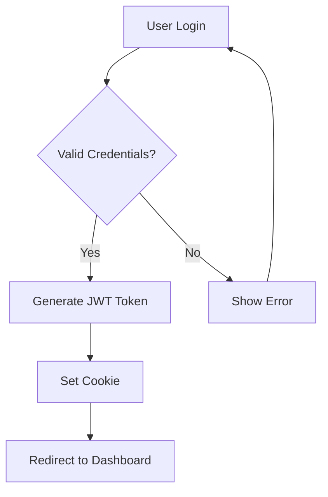
```

### Sequence Diagram

Interaction timelines between entities:

```
User: Diagram the API request flow
Agent: [Generates sequence diagram]
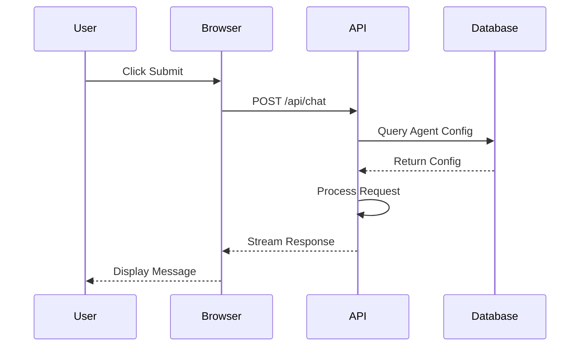
```

### Class Diagram

Object-oriented structure visualization:

```
User: Show me the agent class structure
Agent: [Generates class diagram]
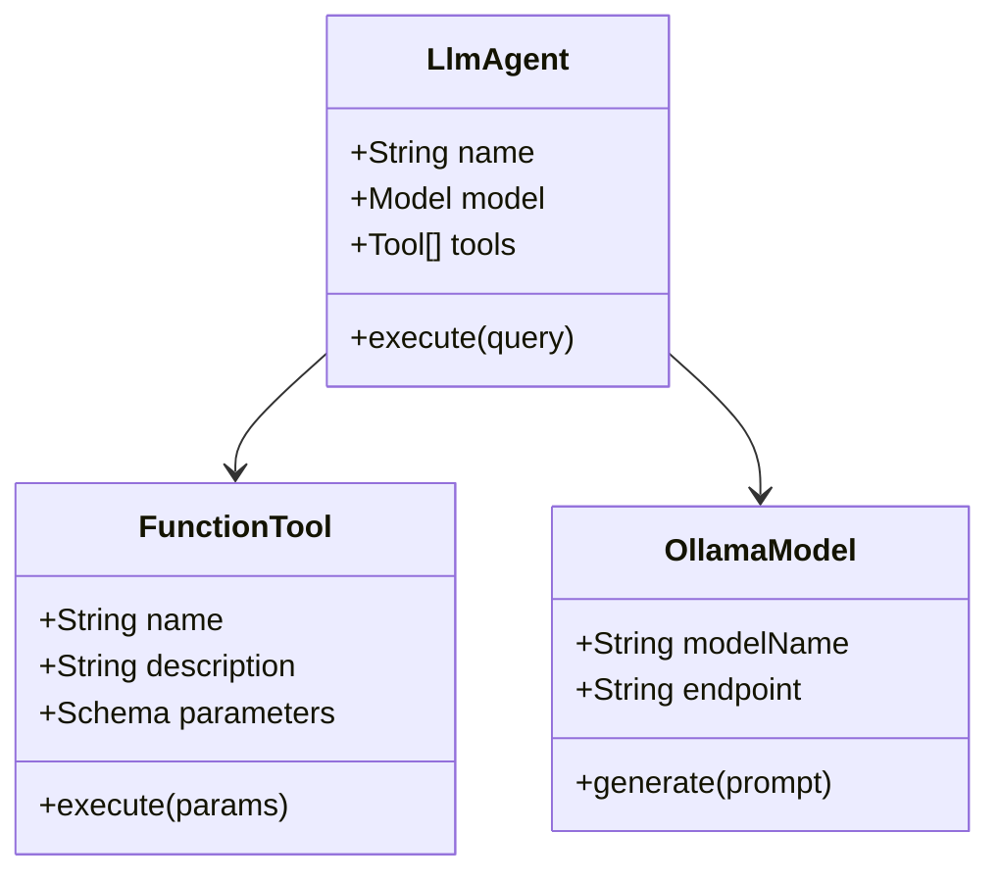
```

### State Diagram

State machine representations:

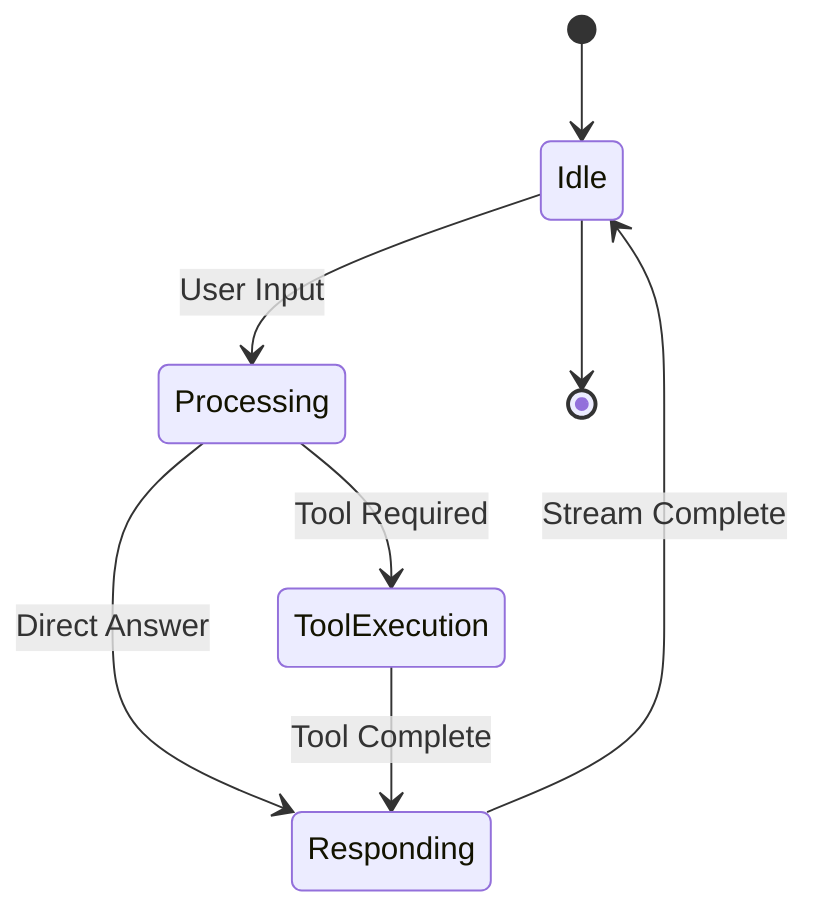

### ER Diagram

Entity relationship diagrams:

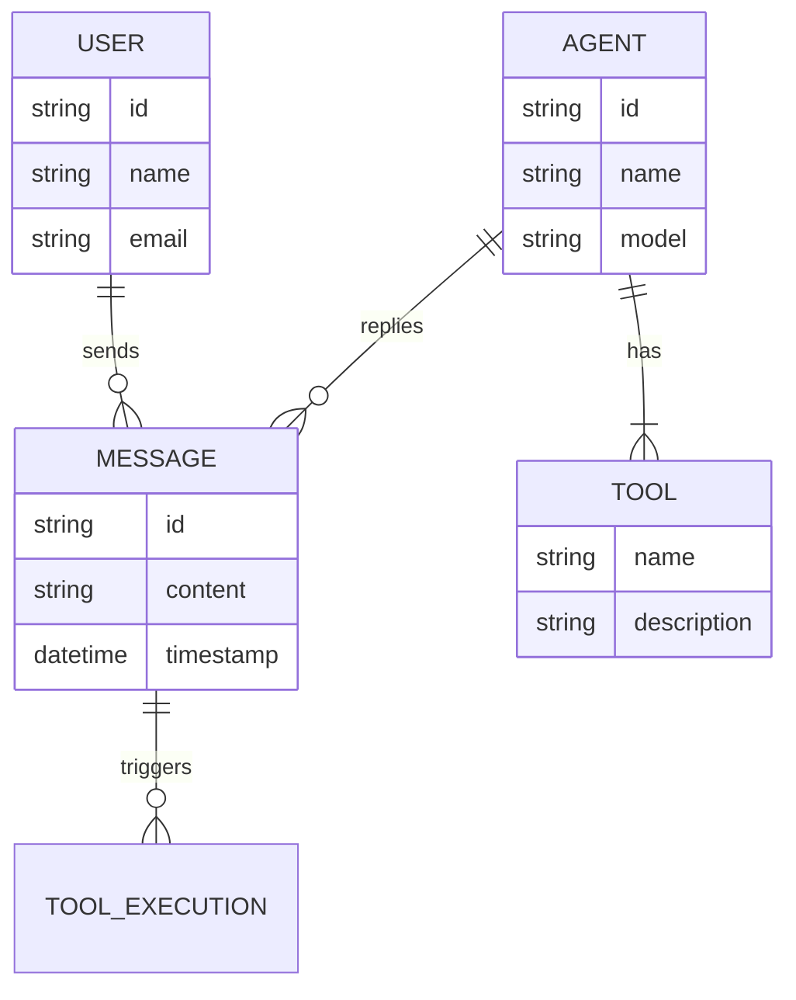

### Gantt Chart

Project timelines:

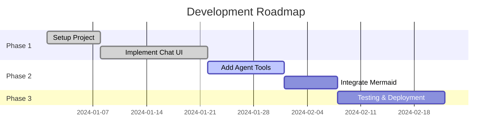

### Pie Chart

Data distribution visualization:

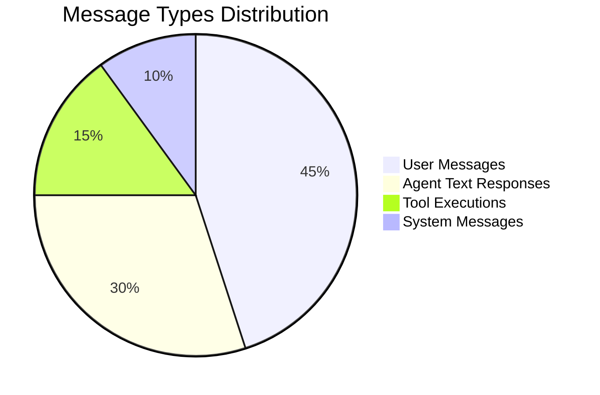

### Mindmap

Hierarchical idea organization:

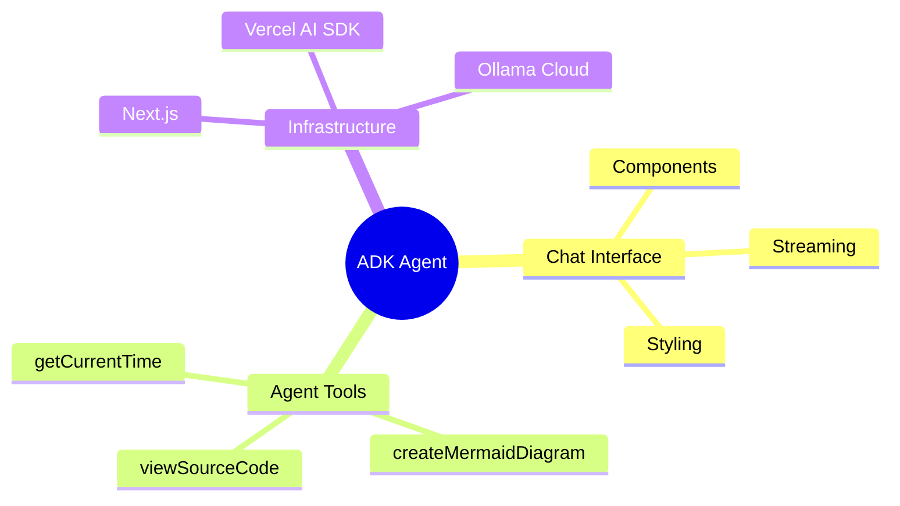

### Timeline

Chronological events:

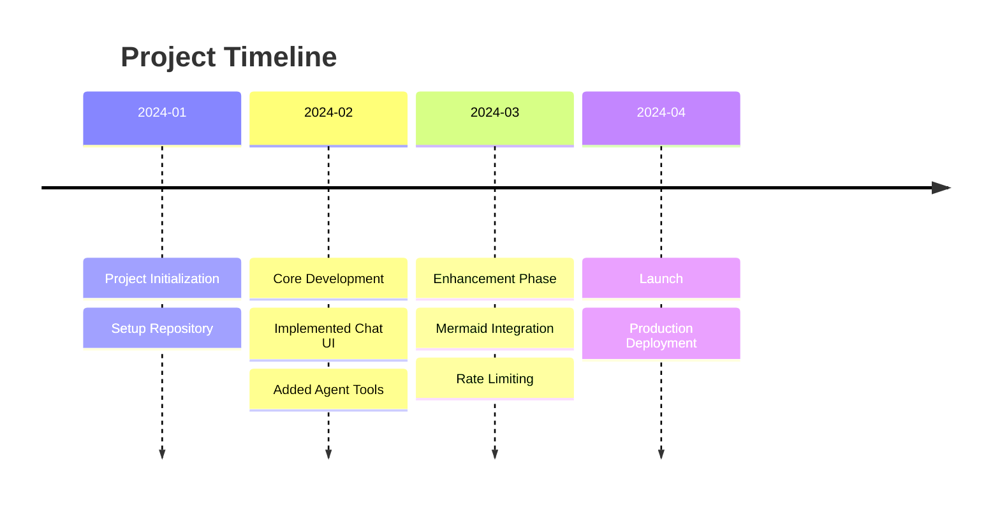

## Usage Examples

### User Prompts That Trigger Diagrams

<CardGroup cols={2}>
  <Card title="Process Flows" icon="diagram-project">
    "Show me how the login flow works"
  </Card>
  <Card title="Visualizations" icon="eye">
    "Create a visual representation of the data model"
  </Card>
  <Card title="Timelines" icon="timeline">
    "Display a timeline of project milestones"
  </Card>
  <Card title="Relationships" icon="diagram-nested">
    "Diagram the relationship between users and agents"
  </Card>
</CardGroup>

### Agent Instructions

The agent is instructed to use the diagram tool appropriately:

```typescript app/agents/agent1.ts
export const rootAgent = new LlmAgent({
  instruction: `You are a helpful assistant.
    If the user asks for a diagram or visual representation, 
    use the 'create_mermaid_diagram' tool.
    Choose the appropriate diagram type based on user needs:
    - Flowcharts for processes and workflows
    - Sequence diagrams for interactions
    - Class diagrams for object structures
    - State diagrams for state machines
    - ER diagrams for data relationships
    - Gantt charts for timelines and schedules
    - Pie charts for distributions
    - Mindmaps for hierarchical concepts
    - Timelines for chronological events`,
  tools: [getCurrentTime, createMermaidDiagram, viewSourceCode],
});
```

## Styling and Customization

### Custom Color Schemes

You can customize the color scheme by modifying `themeVariables`:

```typescript
const mermaid = createMermaidPlugin({
  config: {
    theme: "base",
    themeVariables: {
      // Light theme example
      darkMode: false,
      background: "#ffffff",
      primaryColor: "#e3f2fd",
      primaryTextColor: "#1a1a1a",
      primaryBorderColor: "#2196f3",
      lineColor: "#2196f3",
    },
  },
});
```

### Responsive Diagrams

Diagrams automatically scale to fit container width:

```css
.streamdown-content svg {
  max-width: 100%;
  height: auto;
}
```

## Advanced Features

### Complex Flowcharts

Support for subgraphs and styling:

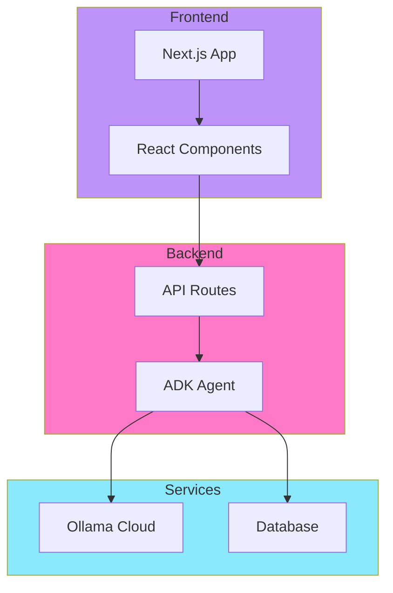

### Interactive Elements

Add click handlers and links:

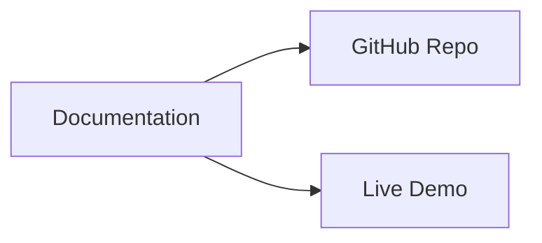

## Performance Considerations

<CardGroup cols={2}>
  <Card title="Lazy Loading" icon="clock">
    Mermaid renders only when diagrams are in viewport
  </Card>
  <Card title="Streaming Support" icon="wave-pulse">
    Diagrams render progressively as markdown streams in
  </Card>
  <Card title="Caching" icon="database">
    Rendered diagrams are cached to avoid re-rendering
  </Card>
  <Card title="Lightweight" icon="feather">
    Plugin adds minimal overhead to bundle size
  </Card>
</CardGroup>

## Troubleshooting

### Common Issues

<Warning>
  **Syntax Errors**: Ensure mermaid syntax is valid. Invalid syntax will show an error message instead of rendering.
</Warning>

<Note>
  **Theme Not Applied**: Verify `createMermaidPlugin` configuration is passed to Streamdown's plugins prop.
</Note>

<Tip>
  **Complex Diagrams**: For very complex diagrams, consider breaking them into multiple smaller diagrams for better readability.
</Tip>

## Best Practices

1. **Choose the Right Type**: Select diagram types that best represent the information
2. **Keep It Simple**: Avoid overly complex diagrams with too many nodes
3. **Use Labels**: Add clear, concise labels to all nodes and edges
4. **Color Coding**: Use subgraphs and styling to group related elements
5. **Test Syntax**: Validate mermaid syntax before embedding in production

## Next Steps

<CardGroup cols={2}>
  <Card title="Agent Tools" icon="wrench" href="/features/agent-tools">
    Explore other agent capabilities
  </Card>
  <Card title="Chat UI" icon="message-square" href="/features/chat-ui">
    Learn about the chat interface
  </Card>
  <Card title="Mermaid Docs" icon="book-open" href="https://mermaid.js.org">
    Official Mermaid.js documentation
  </Card>
  <Card title="Agent Tools" icon="wrench" href="/api/agents/tools">
    Learn about the createMermaidDiagram tool
  </Card>
</CardGroup>