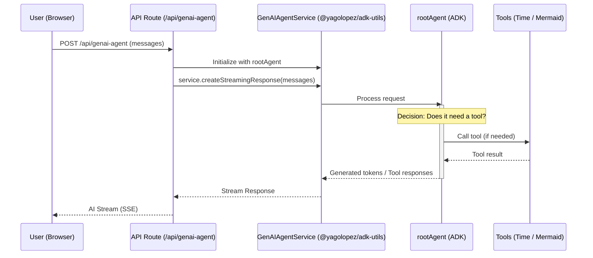

# Welcome to ADK Utils Example

ADK Utils Example is a **modern, high-performance chat application** that demonstrates the seamless integration of Google's Agent Development Kit (ADK) with Next.js 16, React 19, and AI SDK. This project serves as both a practical example and a testing ground for building intelligent, agentic applications.

<Note>
  This project includes an `llms.txt` file for enhanced discoverability and documentation for AI-assisted development.
</Note>

## What is ADK Utils Example?

This application showcases how to build production-ready AI chat interfaces using:

- **Google Agent Development Kit (ADK)** for creating intelligent agents
- **@yagolopez/adk-utils** for enhanced model support (including Ollama integration)
- **Next.js 16** with the modern App Router and React Server Components
- **AI SDK** from Vercel for streamlined AI interactions

## Key Technologies

<CardGroup cols={2}>
  <Card title="Next.js 16" icon="react" href="https://nextjs.org">
    Modern React framework with App Router and React 19
  </Card>
  <Card title="Google ADK" icon="robot" href="https://github.com/google/adk">
    Agent Development Kit for building intelligent agents
  </Card>
  <Card title="ADK Utils" icon="npm" href="https://www.npmjs.com/package/@yagolopez/adk-utils">
    Enhanced utilities including Ollama model support
  </Card>
  <Card title="AI SDK" icon="sparkles" href="https://sdk.vercel.ai">
    Vercel's AI SDK for streamlined integrations
  </Card>
</CardGroup>

## What You'll Build

Following this documentation, you'll learn how to:

- Create AI agents with custom tools and capabilities
- Integrate both cloud-based (Gemini) and local (Ollama) AI models
- Build responsive, streaming chat interfaces
- Implement advanced features like Mermaid diagram generation
- Handle rate limiting and error management
- Test and debug AI agent interactions

## Core Features

### Advanced AI Agents

Built with `@google/adk`, the application features:
- Custom function tools (time retrieval, diagram generation, code visualization)
- Multi-model support (Gemini, Ollama)
- Intelligent tool selection and execution

### Enhanced Model Support

The [`@yagolopez/adk-utils`](https://www.npmjs.com/package/@yagolopez/adk-utils) package provides:
- Seamless Ollama integration within the ADK ecosystem
- Local LLM execution capabilities
- Simplified model instantiation

<CodeGroup>
```typescript Gemini Model
import { LlmAgent } from "@google/adk";

export const agent = new LlmAgent({
  name: "my-agent",
  model: 'gemini-2.5-flash',
  // ... configuration
});
```

```typescript Ollama Model
import { LlmAgent } from "@google/adk";
import { OllamaModel } from "@yagolopez/adk-utils";

export const agent = new LlmAgent({
  name: "my-agent",
  model: new OllamaModel("qwen3:0.6b", "http://localhost:11434"),
  // ... configuration
});
```
</CodeGroup>

### Modern Chat UI

A responsive, premium chat interface featuring:
- **Streaming responses** with real-time updates
- **Markdown rendering** with syntax highlighting
- **Mermaid.js diagrams** for visual representations
- **Interactive suggestions** and empty state
- **Auto-scroll** for seamless user experience
- **Typing indicators** for real-time feedback

### Smart Components

Production-ready features:
- **Rate limiting** using `@tanstack/react-pacer` to protect resources
- **Efficient scrolling** with custom hooks
- **Error handling** and graceful degradation
- **Responsive design** with Tailwind CSS 4

### Built-in Tools

The example agent comes with three function tools:

1. **`get_current_time`** - Retrieves the current time for any city worldwide
2. **`create_mermaid_diagram`** - Generates visual flowcharts, sequence diagrams, and more
3. **`view_source_code`** - Displays source code examples

<Tip>
  These tools demonstrate how to extend your agent's capabilities with custom functions using Zod schemas for parameter validation.
</Tip>

## Architecture Overview

The application follows a modern, scalable architecture:



## Who Should Use This?

This project is perfect for:

- **Developers** building AI-powered chat applications
- **Engineers** exploring Google's Agent Development Kit
- **Teams** looking to integrate local AI models with Ollama
- **Students** learning about modern AI application architecture
- **Researchers** prototyping agentic systems

## Why ADK Utils?

The `@yagolopez/adk-utils` package solves a critical challenge: **seamless integration of Ollama models within the ADK ecosystem**. This means you can:

- Run AI models locally without cloud dependencies
- Reduce latency and costs
- Maintain privacy with on-device inference
- Switch between cloud and local models effortlessly

## Next Steps

<CardGroup cols={2}>
  <Card title="Quickstart" icon="rocket" href="/quickstart">
    Get up and running in under 5 minutes
  </Card>
  <Card title="Installation" icon="download" href="/installation">
    Detailed setup and configuration guide
  </Card>
  <Card title="Architecture" icon="diagram-project" href="/architecture/project-structure">
    Understand the system architecture
  </Card>
  <Card title="API Reference" icon="code" href="/api/routes/genai-agent">
    Explore the API documentation
  </Card>
</CardGroup>

## Tech Stack Summary

<AccordionGroup>
  <Accordion title="Frontend Technologies">
    - **Next.js 16** - React framework with App Router
    - **React 19** - Latest UI library
    - **Tailwind CSS 4** - Utility-first styling
    - **Lucide React** - Icon library
    - **@ai-sdk/react** - React hooks for AI interactions
  </Accordion>
  
  <Accordion title="AI & Agent Technologies">
    - **@google/adk** - Agent Development Kit
    - **@yagolopez/adk-utils** - Enhanced ADK utilities
    - **@ai-sdk/google** - Google AI SDK integration
    - **AI SDK** - Vercel's AI SDK
    - **Zod** - Schema validation for tool parameters
  </Accordion>
  
  <Accordion title="Developer Tools">
    - **TypeScript 5** - Type safety
    - **ESLint** - Code quality
    - **Prettier** - Code formatting
    - **Jest** - Unit testing
    - **Playwright** - E2E testing
  </Accordion>
  
  <Accordion title="UI Components">
    - **Radix UI** - Accessible components
    - **Streamdown** - Markdown rendering
    - **@streamdown/mermaid** - Diagram support
    - **TanStack Pacer** - Rate limiting
  </Accordion>
</AccordionGroup>

## Open Source

This project is open source and available under the MIT License. Contributions are welcome!

<Card title="View on GitHub" icon="github" href="https://github.com/YagoLopez/adk-utils-example">
  Star the repository and contribute to the project
</Card>